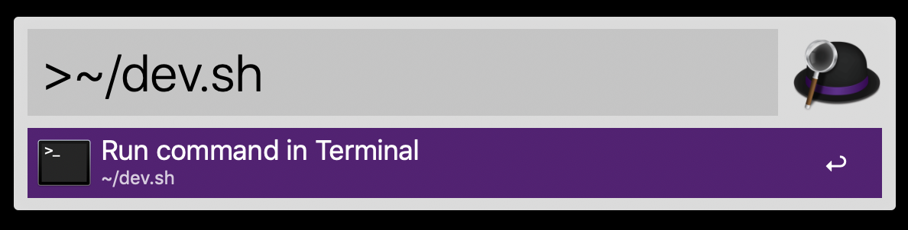
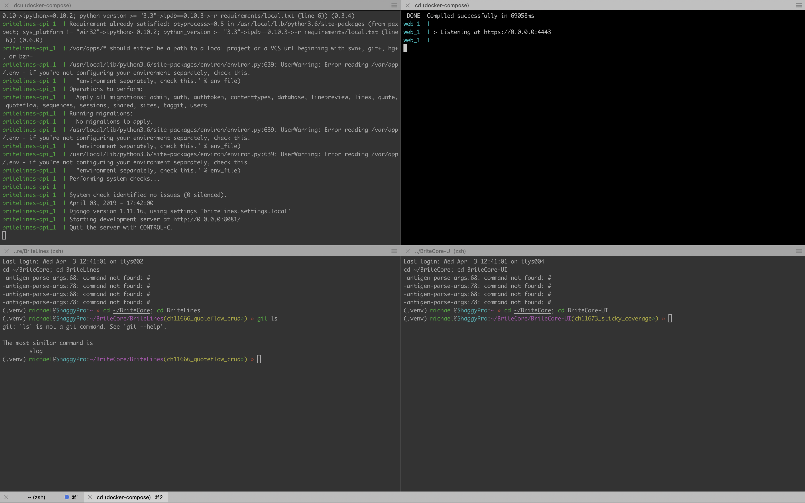

# My Dotfiles Config

## ZSH

[Installation instructions](https://ohmyz.sh/)

[Oh-My-Zsh Installation instructions](https://github.com/robbyrussell/oh-my-zsh)

## Tmux

[Installation instructions](https://github.com/tmux/tmux)

## Vim (NeoVim)

[Installation Instructions](https://github.com/neovim/neovim/wiki/Installing-Neovim)

[Vim Theme](https://github.com/joshdick/onedark.vim)

## itermocil

[Installation instruction](https://github.com/TomAnthony/itermocil#installing-itermocil)

#### Sample Use case
1. First start docker
1. run `~/dev.sh` after docker starts

TIP: you can use Alfred to make it even faster:

Configurations will give you a four window terminal and start your lines and ui.

#### Files
* [~/dev.sh](iTermocil/dev.sh)
* [~/.itermocil/britecore.yml](iTermocil/britecore.yml)
